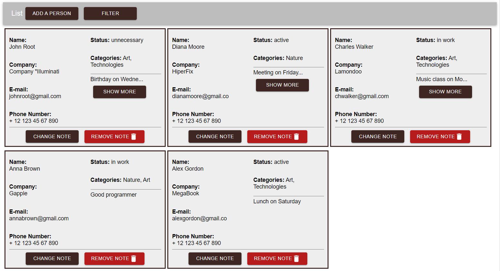
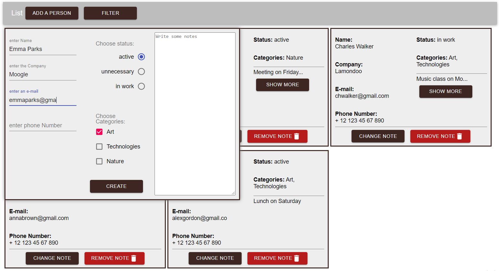
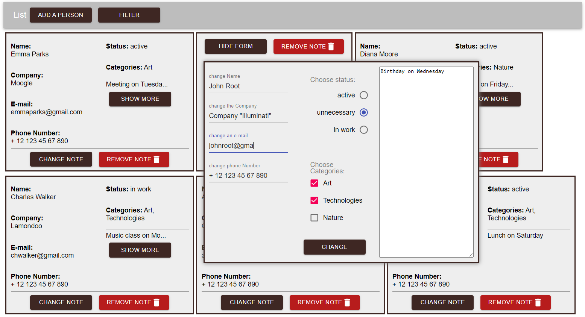
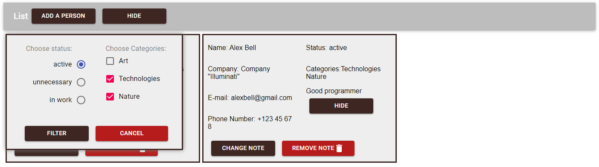

# React-MongoDB-Project
made by Nick Shpilevsky

This project was created to learn and practice React and MongoDB databases.  
I created Back-End and used Material-UI library and Webpack.
All notes are stored in remote database, so they don't disappear after reloading page.  They are got from remote databse by chunks in readable stream.
There is an ability to filter notes to find ones you need by status and categories.

# Usage
1. ```npm install```
2. ```node server.js```
3. ```cd client```
4. ```npm install```
5. ```npm run dev```

# Demo







