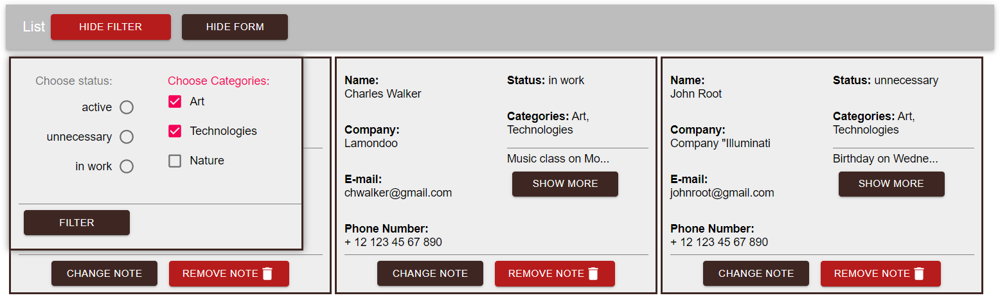

# React-MongoDB-Project
made by Nick Shpilevsky

This project was created to learn and practice React and MongoDB databases.  
I created Back-End and used Material-UI library and Webpack.  
All notes are stored in database, so they don't disappear after reloading page.  
There is an ability to filer notes to find ones you need by status and categories.

# Usage
1. ```npm i```
2. ```npm run build```
3. ```cd Back-End```
4. ```npm i```
5. ```node main.js```

# Demo



